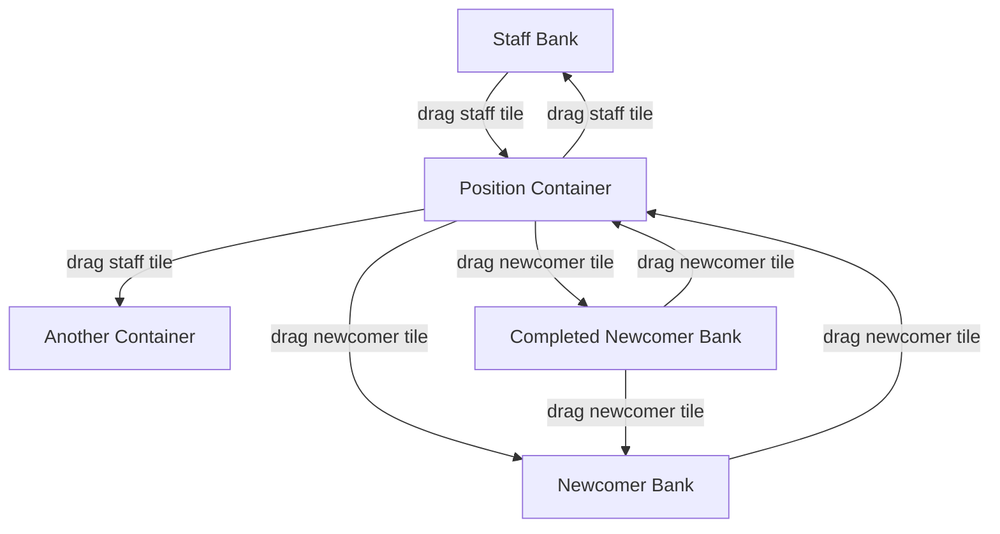

# Chotolate — Zone Model

## 1. Overview

Zones are the spatial backbone of the Chotolate command board. Every tile must belong to a zone at all times. This document defines zone types, their creation, behavior, layout rules, and constraints.

---

## 2. Zone Types

### 2.1 Taxonomy

```
Zone (abstract)
├── Container Zone (user-created, freely positioned)
│   └── Position Container — represents an operational position
├── Bank Zone (system-provided, fixed position)
│   ├── Staff Bank — unassigned staff
│   ├── Newcomer Bank — awaiting processing
│   └── Completed Newcomer Bank — finished processing
```

### 2.2 Comparison

| Property | Container Zone | Bank Zone |
|----------|---------------|-----------|
| Created by | Operator | System (fixed) |
| Movable | Yes (free positioning) | No |
| Resizable | Yes (with constraints) | No (auto-sizes or scrolls) |
| Deletable | Yes (with confirmation) | No |
| Renamable | Yes | No |
| Tile types accepted | Staff + Newcomer | Type-specific |
| Max tile count | Unlimited (scrollable internal layout) | Unlimited (scrollable) |
| Display position | Board canvas | Fixed UI regions |

---

## 3. Container Zone Creation

### 3.1 Creation Flow

```
Operator clicks [+ Container]
    → New container materializes on board canvas
    → Default size: 240×160 px
    → Default position: center of current viewport
    → Name field activates in edit mode
    → Operator types name → presses Enter
    → Container enters idle state
```

### 3.2 Container Properties

| Property | Type | Default | Editable |
|----------|------|---------|----------|
| `id` | UUID | Auto-generated | No |
| `name` | String | "New Position" | Yes |
| `x` | Number (px) | Viewport center X | Yes (drag) |
| `y` | Number (px) | Viewport center Y | Yes (drag) |
| `width` | Number (px) | 240 | Yes (resize) |
| `height` | Number (px) | 160 | Yes (resize) |
| `zIndex` | Number | Auto-incremented | Auto (on interact) |
| `tileIds` | UUID[] | [] | Auto (on drop) |
| `createdAt` | Timestamp | Now | No |

---

## 4. Container Positioning

### 4.1 Free Positioning Rules

- Containers are **freely positionable** on the board canvas — no grid snapping
- Containers can be adjacent to each other but **should not overlap**
  - The system does not prevent overlap but visually discourages it
  - Overlapping containers receive a **warning indicator** (amber border)
- Container position is set by dragging the container's **header bar**
- The header bar is visually distinct from the container body (darker color, grab cursor)

### 4.2 Z-Index Management

When a container is interacted with (clicked, dragged, receives a tile drop), its z-index is set to `max(allContainers.zIndex) + 1`, bringing it to the front.

---

## 5. Container Resizing

### 5.1 Resize Handles

```
  NW ─── N ─── NE
   │            │
   W           E
   │            │
  SW ─── S ─── SE
```

All 8 handles are available for resizing. Handles are visible on hover and during resize.

### 5.2 Minimum Size Constraint

The container's minimum size is **dynamically calculated** based on its contents:

```
minWidth  = max(ABSOLUTE_MIN_WIDTH,  columns × tileWidth  + (columns + 1) × gap)
minHeight = max(ABSOLUTE_MIN_HEIGHT, rows    × tileHeight + (rows + 1)    × gap + headerHeight)
```

Where:
- `ABSOLUTE_MIN_WIDTH` = 120px (enough for container name + controls)
- `ABSOLUTE_MIN_HEIGHT` = 80px (enough for header + one tile row)
- `columns` = number of columns in the current internal grid layout
- `rows` = ceil(tileCount / columns)
- `tileWidth`, `tileHeight` = fixed tile dimensions
- `gap` = internal grid spacing (8px)
- `headerHeight` = height of the container header bar (36px)

### 5.3 Resize Behavior

| Action | Result |
|--------|--------|
| Enlarge | Internal grid recalculates — more columns may fit, fewer rows needed |
| Shrink | Internal grid recalculates — fewer columns, more rows |
| Hit minimum | Resize handle stops — visual feedback (handle turns amber) |
| Remove tile | Minimum recalculates — container may now shrink further |
| Add tile | Minimum recalculates — container may need to grow |

### 5.4 Auto-Grow on Tile Add

When a tile is dropped into a container that is at minimum size, and the new tile would cause the internal layout to exceed the container's current bounds:

- The container **auto-grows** to accommodate the new tile
- Growth follows the most natural direction (increases height to add a new row)
- The operator can then manually resize as needed

---

## 6. Internal Container Layout

### 6.1 Grid Layout Algorithm

Tiles inside a container are arranged in a **wrapped grid layout**:

```
Container (320px wide, gap=8px, tileWidth=100px):

Available content width = 320 - 2×8 = 304px
Columns that fit = floor((304 + 8) / (100 + 8)) = floor(312 / 108) = 2

Layout:
    ┌────────────────────────────────────┐
    │  Container Name           [3]     │  ← header
    ├────────────────────────────────────┤
    │  ┌──────────┐  ┌──────────┐       │
    │  │  Tile 1   │  │  Tile 2   │      │
    │  └──────────┘  └──────────┘       │
    │  ┌──────────┐                     │
    │  │  Tile 3   │                     │
    │  └──────────┘                     │
    └────────────────────────────────────┘
```

### 6.2 Layout Rules

1. Tiles are placed **left-to-right, top-to-bottom**
2. Each tile has **identical dimensions** (fixed system-wide tile size)
3. Spacing between tiles is a **consistent gap** (8px)
4. Padding from container edges to first/last tile is also the **gap** value
5. Row wrapping occurs when the next tile would exceed the container's content width
6. **No tile overlapping** — this is structurally impossible with grid layout

### 6.3 Layout Recalculation Triggers

| Trigger | Action |
|---------|--------|
| Tile added | Recalculate grid, update rows/columns, update count |
| Tile removed | Recalculate grid, collapse gaps, update count |
| Container resized | Recalculate columns from new width, reflow tiles |
| Container created | Initialize empty grid |

### 6.4 Tile Ordering

Within a container, tiles are ordered by:

1. **Drop order** (most recent drop is last) — default
2. Operator may reorder tiles within a container by dragging (future enhancement)

---

## 7. Container Deletion

### 7.1 Flow

1. Operator opens container context menu (right-click or header menu button)
2. Selects "Delete Container"
3. Confirmation dialog: _"Delete [Container Name]? X tiles will be returned to their banks."_
4. On confirm:
   - All staff tiles return to Staff Bank
   - All newcomer tiles return to Newcomer Bank
   - Container is removed from the board

### 7.2 Constraints

- A container **can be deleted** even if it contains tiles
- Tiles are **never deleted** when their container is deleted — they return to banks
- Deletion is **undoable** within 10 seconds (snackbar with undo button)

---

## 8. Bank Zone Specifications

### 8.1 Staff Bank

| Property | Value |
|----------|-------|
| Position | Left sidebar |
| Layout | Vertical stack, top-to-bottom |
| Scroll | Vertical, scrollbar when content overflows |
| Accepts | Staff tiles only |
| Header | "Staff Bank" + count badge |
| Default state | Contains all staff tiles before assignment |

### 8.2 Newcomer Bank

| Property | Value |
|----------|-------|
| Position | Right sidebar |
| Layout | Vertical stack, top-to-bottom |
| Scroll | Vertical, scrollbar when content overflows |
| Accepts | Newcomer tiles only |
| Header | "Newcomer Bank" + count badge |
| Default state | Contains all newcomer tiles before processing |

### 8.3 Completed Newcomer Bank

| Property | Value |
|----------|-------|
| Position | Bottom bar |
| Layout | Horizontal flow, left-to-right |
| Scroll | Horizontal, scrollbar when content overflows |
| Accepts | Newcomer tiles only |
| Header | "Completed" + count badge |
| Default state | Empty |

---

## 9. Zone Interaction Summary



All movements are operator-initiated drag-and-drop. No automated movements.
