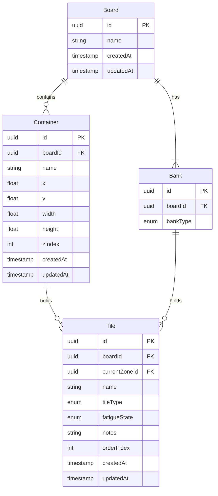

# Chotolate — Data Model

## 1. Overview

This document defines the complete data structures for Chotolate, including entity schemas, relationships, and persistence format. The data model is designed for **local-first** storage with optional remote sync in future phases.

---

## 2. Entity Relationship Diagram



---

## 3. Entity Schemas

### 3.1 Board

The top-level entity. Represents a single command board instance.

```typescript
interface Board {
  id: string;           // UUID v4
  name: string;         // Board display name (e.g., "Summer Festival 2026")
  createdAt: string;    // ISO 8601 timestamp
  updatedAt: string;    // ISO 8601 timestamp
}
```

| Field | Type | Constraints |
|-------|------|-------------|
| `id` | UUID | Primary key, auto-generated |
| `name` | String | Required, 1–100 characters |
| `createdAt` | ISO 8601 | Auto-set on creation |
| `updatedAt` | ISO 8601 | Auto-updated on any mutation |

### 3.2 Container

A user-created position zone on the board canvas.

```typescript
interface Container {
  id: string;           // UUID v4
  boardId: string;      // FK → Board.id
  name: string;         // Position name (e.g., "Front Gate")
  x: number;            // X position in canvas pixels
  y: number;            // Y position in canvas pixels
  width: number;        // Width in pixels
  height: number;       // Height in pixels
  zIndex: number;       // Stacking order
  createdAt: string;    // ISO 8601 timestamp
  updatedAt: string;    // ISO 8601 timestamp
}
```

| Field | Type | Constraints |
|-------|------|-------------|
| `id` | UUID | Primary key, auto-generated |
| `boardId` | UUID | Foreign key → Board, required |
| `name` | String | Required, 1–60 characters |
| `x` | Number | Float, >= 0 |
| `y` | Number | Float, >= 0 |
| `width` | Number | Float, >= ABSOLUTE_MIN_WIDTH (120) |
| `height` | Number | Float, >= ABSOLUTE_MIN_HEIGHT (80) |
| `zIndex` | Number | Integer, >= 0 |
| `createdAt` | ISO 8601 | Auto-set on creation |
| `updatedAt` | ISO 8601 | Auto-updated on any mutation |

### 3.3 Bank

A system-provided fixed zone. Created automatically when a board is created.

```typescript
interface Bank {
  id: string;           // UUID v4
  boardId: string;      // FK → Board.id
  bankType: BankType;   // Enum value
}

enum BankType {
  STAFF = "staff",
  NEWCOMER = "newcomer",
  COMPLETED_NEWCOMER = "completed_newcomer"
}
```

| Field | Type | Constraints |
|-------|------|-------------|
| `id` | UUID | Primary key, auto-generated |
| `boardId` | UUID | Foreign key → Board, required |
| `bankType` | Enum | One of: `staff`, `newcomer`, `completed_newcomer` |

Each board has **exactly 3 banks** (one of each type), created at board initialization.

### 3.4 Tile

A movable tile representing a person.

```typescript
interface Tile {
  id: string;              // UUID v4
  boardId: string;         // FK → Board.id
  currentZoneId: string;   // FK → Container.id OR Bank.id
  name: string;            // Display name
  tileType: TileType;      // Enum value
  fatigueState: FatigueState; // Enum value
  notes: string;           // Freeform text
  orderIndex: number;      // Position within current zone
  createdAt: string;       // ISO 8601 timestamp
  updatedAt: string;       // ISO 8601 timestamp
}

enum TileType {
  STAFF = "staff",
  NEWCOMER = "newcomer"
}

enum FatigueState {
  GREEN = "green",
  YELLOW = "yellow",
  RED = "red"
}
```

| Field | Type | Constraints |
|-------|------|-------------|
| `id` | UUID | Primary key, auto-generated |
| `boardId` | UUID | Foreign key → Board, required |
| `currentZoneId` | UUID | FK → Container or Bank, required |
| `name` | String | Required, 1–40 characters |
| `tileType` | Enum | `"staff"` or `"newcomer"`, immutable after creation |
| `fatigueState` | Enum | `"green"`, `"yellow"`, or `"red"` |
| `notes` | String | Optional, 0–500 characters |
| `orderIndex` | Number | Integer, >= 0, determines display order in zone |
| `createdAt` | ISO 8601 | Auto-set on creation |
| `updatedAt` | ISO 8601 | Auto-updated on any mutation |

---

## 4. Relationships

### 4.1 Board → Zones

A Board has:
- 0 to many **Containers** (user-created)
- Exactly 3 **Banks** (system-created: staff, newcomer, completed_newcomer)

### 4.2 Zone → Tiles

A Zone (Container or Bank) has:
- 0 to many **Tiles**

Each Tile belongs to **exactly one Zone** at all times. This is enforced by the `currentZoneId` foreign key on the Tile.

### 4.3 Tile Type → Bank Constraints

| Tile Type | Allowed Banks |
|-----------|---------------|
| Staff | Staff Bank |
| Newcomer | Newcomer Bank, Completed Newcomer Bank |

Both tile types can be placed in any Container.

---

## 5. Container Membership Derivation

There is no separate membership table. Membership is derived:

```
Tiles in Container X = SELECT * FROM tiles WHERE currentZoneId = X.id
Tile count for X = COUNT(tiles WHERE currentZoneId = X.id)
```

This keeps the data model flat and avoids sync issues between a membership table and the tile's zone reference.

---

## 6. Layout Metadata

Layout is **computed, not stored**. The internal grid layout of tiles within a container is calculated on-the-fly from:

| Input | Source |
|-------|--------|
| Container width | `Container.width` |
| Container height | `Container.height` |
| Tile dimensions | System constants (`TILE_WIDTH`, `TILE_HEIGHT`) |
| Grid gap | System constant (`GRID_GAP`) |
| Tile count | Derived from `tiles WHERE currentZoneId = container.id` |
| Tile order | `Tile.orderIndex` |

### 6.1 System Layout Constants

```typescript
const LAYOUT_CONSTANTS = {
  TILE_WIDTH: 140,        // px
  TILE_HEIGHT: 48,        // px
  GRID_GAP: 8,            // px
  CONTAINER_HEADER_HEIGHT: 36, // px
  CONTAINER_MIN_WIDTH: 120,    // px
  CONTAINER_MIN_HEIGHT: 80,    // px
  CONTAINER_DEFAULT_WIDTH: 240, // px
  CONTAINER_DEFAULT_HEIGHT: 160, // px
};
```

---

## 7. Persistence Model

### 7.1 MVP Storage

The MVP uses **browser LocalStorage** with JSON serialization.

```typescript
interface BoardState {
  board: Board;
  containers: Container[];
  banks: Bank[];
  tiles: Tile[];
}

// Storage key format: "chotolate:board:{boardId}"
// Value: JSON.stringify(BoardState)
```

### 7.2 Storage Operations

| Operation | Trigger |
|-----------|---------|
| **Save** | Debounced auto-save (500ms after last mutation) |
| **Load** | On application startup |
| **Export** | Manual action → downloads JSON file |
| **Import** | Manual action → uploads JSON file |

### 7.3 Data Integrity

On load, the application validates:

1. All `currentZoneId` references point to existing zones
2. All `boardId` references match the loaded board
3. Bank count is exactly 3 (one per type)
4. No orphaned tiles (tiles without valid zone references)

Invalid data triggers a **recovery flow** that reassigns orphaned tiles to their type-appropriate bank.

---

## 8. Future Persistence (Post-MVP)

| Phase | Storage | Sync |
|-------|---------|------|
| MVP | LocalStorage | None |
| Phase 2 | IndexedDB | None (larger data capacity) |
| Phase 3 | IndexedDB + Remote Database | Real-time sync via WebSocket |
| Phase 4 | Cloud-first | Offline-capable with conflict resolution |

---

## 9. Data Limits

| Entity | MVP Limit | Rationale |
|--------|-----------|-----------|
| Boards | 10 | LocalStorage size (~5MB) |
| Containers per board | 50 | Performance (DOM elements) |
| Tiles per board | 200 | Performance + LocalStorage |
| Name length | 40 chars | Tile display size |
| Notes length | 500 chars | Reasonable metadata |

These are soft limits enforced with validation messages, not hard crashes.
