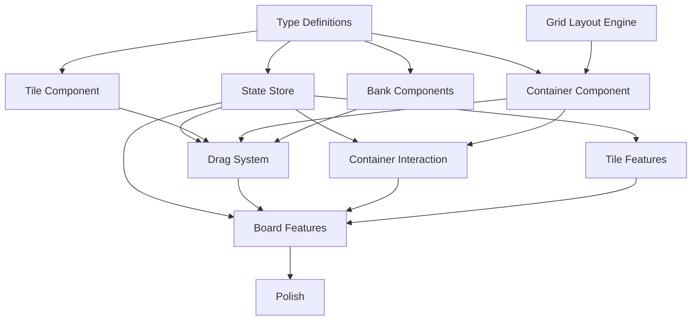

# Chotolate — Implementation Plan

## 1. MVP Definition

The MVP delivers a **fully functional, single-operator command board** with:

| Feature | Included |
|---------|----------|
| Board canvas with pan/scroll | ✅ |
| Container creation, naming, positioning | ✅ |
| Container resizing with constraints | ✅ |
| Staff tile creation | ✅ |
| Newcomer tile creation | ✅ |
| Drag-and-drop between zones | ✅ |
| Snap-to-grid layout inside containers | ✅ |
| Staff Bank, Newcomer Bank, Completed Bank | ✅ |
| Fatigue color toggle (green/yellow/red) | ✅ |
| Tile info modal (name, notes, fatigue) | ✅ |
| Search / find with highlight | ✅ |
| Auto-save to LocalStorage | ✅ |
| Container deletion with tile recovery | ✅ |
| Tile deletion with undo | ✅ |
| Multi-user / real-time sync | ❌ Post-MVP |
| Keyboard drag | ❌ Post-MVP |
| Board templates | ❌ Post-MVP |
| Export / import board | ❌ Post-MVP |
| Mobile support | ❌ Post-MVP |

---

## 2. Build Order

The implementation follows a **bottom-up** approach: foundational systems first, then composition, then polish.

```
Phase 1: Foundation
    ├── Project setup (Vite + React + TypeScript)
    ├── Type definitions
    ├── State store (Zustand)
    └── CSS design tokens + reset

Phase 2: Core Components
    ├── Tile component (static rendering)
    ├── Container component (static rendering)
    ├── Bank components (static rendering)
    └── Internal grid layout engine

Phase 3: Drag System
    ├── @dnd-kit integration
    ├── Custom cursor-point collision
    ├── Drop validation
    ├── Drag overlay
    └── Container hover highlighting

Phase 4: Container Interaction
    ├── Container creation flow
    ├── Container positioning (drag header)
    ├── Container resizing (8-point handles)
    ├── Minimum size constraints
    └── Container deletion

Phase 5: Tile Features
    ├── Tile creation flow (staff + newcomer)
    ├── Tile info modal
    ├── Fatigue toggle
    ├── Tile deletion with undo
    └── Tile inline name editing

Phase 6: Board Features
    ├── Board canvas (pan and scroll)
    ├── Search / find highlighting
    ├── Toolbar assembly
    ├── Mode toggle (setup / command)
    └── Auto-save persistence

Phase 7: Polish
    ├── Animations (snap, return, highlight)
    ├── Container count badges
    ├── Responsive bank collapsing
    ├── Edge case handling
    └── Performance optimization
```

---

## 3. Dependency Graph



---

## 4. UI Component List

### 4.1 Layout Components

| Component | Purpose | Priority |
|-----------|---------|----------|
| `App` | Root, providers, layout shell | P0 |
| `MainLayout` | Three-column layout (banks + canvas) | P0 |
| `Board` | Scrollable canvas wrapper | P0 |
| `BoardCanvas` | Absolute-positioned container host | P0 |

### 4.2 Zone Components

| Component | Purpose | Priority |
|-----------|---------|----------|
| `Container` | Position zone with header + grid | P0 |
| `ContainerHeader` | Name label, count badge, controls | P0 |
| `ContainerGrid` | Tile grid layout inside container | P0 |
| `ResizeHandles` | 8-point resize controls | P0 |
| `StaffBank` | Left sidebar bank | P0 |
| `NewcomerBank` | Right sidebar bank | P0 |
| `CompletedBank` | Bottom bar bank | P0 |
| `BankContainer` | Shared bank container logic | P0 |

### 4.3 Tile Components

| Component | Purpose | Priority |
|-----------|---------|----------|
| `Tile` | Draggable tile with role indicator | P0 |
| `TileDragOverlay` | Floating drag preview | P0 |
| `FatigueIndicator` | Color dot with cycle-on-click | P0 |
| `TileInfoButton` | Opens tile info modal | P0 |

### 4.4 Toolbar Components

| Component | Purpose | Priority |
|-----------|---------|----------|
| `Toolbar` | Top bar container | P0 |
| `SearchBar` | Search input with clear | P0 |
| `ModeToggle` | Setup ↔ Command switch | P1 |
| `CreateButtons` | + Staff, + Newcomer, + Container | P0 |

### 4.5 Modal Components

| Component | Purpose | Priority |
|-----------|---------|----------|
| `TileInfoModal` | Edit tile name, notes, fatigue | P0 |
| `ContainerEditModal` | Edit container name | P1 |
| `DeleteConfirmModal` | Confirm before deletion | P0 |

### 4.6 Utility Components

| Component | Purpose | Priority |
|-----------|---------|----------|
| `CountBadge` | Tile count display on zones | P1 |
| `UndoSnackbar` | Undo action after deletion | P1 |

---

## 5. Risk Areas

### 5.1 High Risk

| Risk | Impact | Mitigation |
|------|--------|------------|
| **Drag performance at scale** | Janky drag with 100+ tiles on board | Profile early; use CSS transforms, memoization, virtual rendering |
| **Container resize + layout constraint** | Complex bidirectional dependency between container size and tile count | Implement minimum size calculation as a pure function; test thoroughly |
| **Custom collision detection** | @dnd-kit's collision API may not expose cursor coordinates in all edge cases | Prototype collision detection in isolation first; verify touch behavior |

### 5.2 Medium Risk

| Risk | Impact | Mitigation |
|------|--------|------------|
| **LocalStorage limits** | Board data exceeds 5MB limit | Monitor storage size; implement export early; plan IndexedDB migration |
| **Touch drag vs. scroll conflict** | On tablets, drag initiation conflicts with canvas scroll | Use long-press delay (300ms) for touch drag initiation |
| **Z-index management** | Overlapping containers create confusing drop targets | Auto-increment z-index on interaction; discourage visual overlap |

### 5.3 Low Risk

| Risk | Impact | Mitigation |
|------|--------|------------|
| **Browser compatibility** | Minor CSS differences | Test on Chrome, Firefox, Safari; use CSS contained features |
| **State corruption** | Invalid LocalStorage data | Validation + recovery on load |
